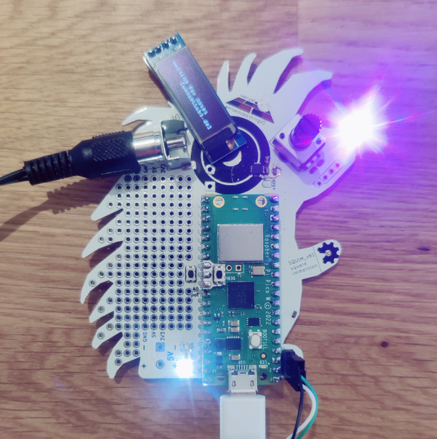
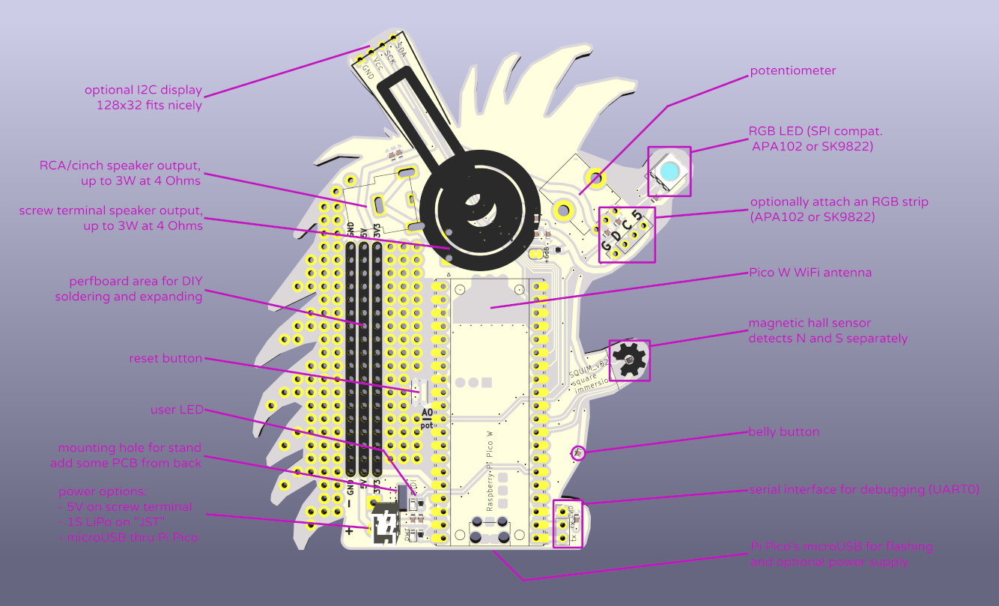
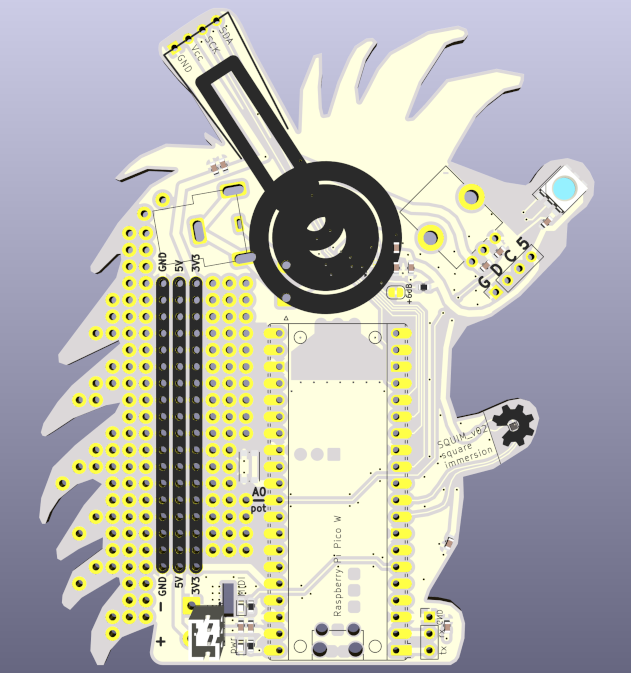
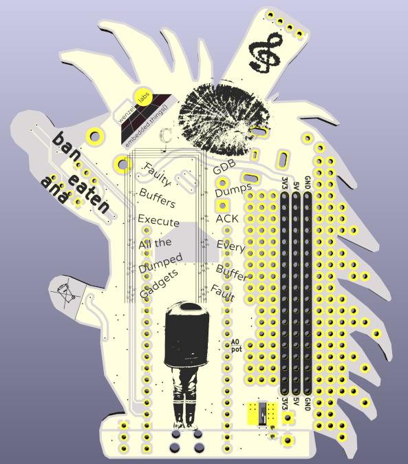

# SQUIM - suqare immersion

a hardware platform for the **Raspberry Pi Pico W** to explore audio.

the SQUIM hedgehog can be used to explore audio on the Pi Pico W, or other features of the pcb. we use it with [our firmware, pico-square-immersion](https://github.com/wenzellabs/pico-square-immersion) which is based on [J&uuml;rgen Reuter's simple-stupid-synth](https://github.com/soundpaint/pico-simple-stupid-synth), but obviously pretty much any firmware for the Pi Pico W can run on this board.

the PCB features:
- I2S audio interface (MAX98357A) with 3W speaker output
- one RGB LED (APA102 or SK9822), expandable through pin header
- I2C display (optional)
- one potentiometer (optional)
- one hall sensor with separate N and S outputs (AH1391-FS4-7)
- UART debug pin header (optional)
- perfboard area for DIY soldering and expanding

As we write this (end of 2024) there is still no RP2350 based **Pi Pico 2 W**, but we see no issues whatsoever why it shouldn't work on our board once it's out.

